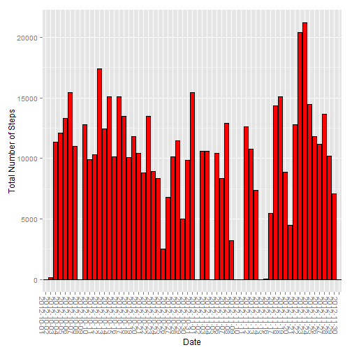
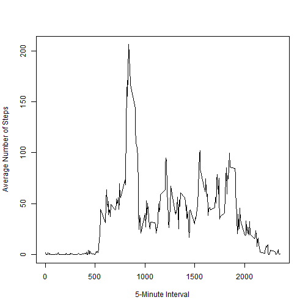
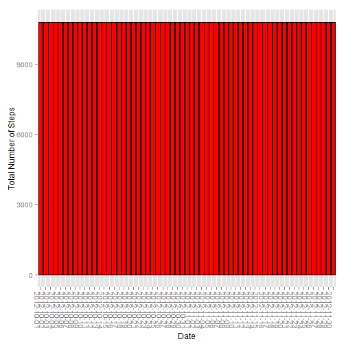
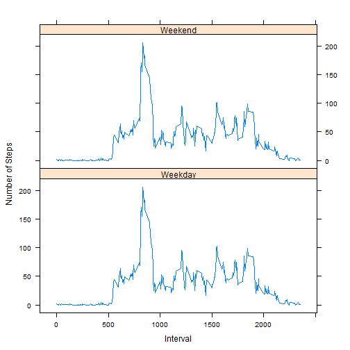

# Reproducible Research: Peer Assessment 1


## Loading and preprocessing the data


```r
data <- read.csv(unz("activity.zip", "activity.csv"),
                 sep=",",
                 header=TRUE,
                 stringsAsFactors=FALSE)
head(data, 10)
```

```
##    steps       date interval
## 1     NA 2012-10-01        0
## 2     NA 2012-10-01        5
## 3     NA 2012-10-01       10
## 4     NA 2012-10-01       15
## 5     NA 2012-10-01       20
## 6     NA 2012-10-01       25
## 7     NA 2012-10-01       30
## 8     NA 2012-10-01       35
## 9     NA 2012-10-01       40
## 10    NA 2012-10-01       45
```

## What is mean total number of steps taken per day?

### Make a histogram of the total number of steps taken each day.


```r
library(ggplot2)
qplot(date, 
      data=data, 
      weight=steps, 
      geom="histogram", 
      xlab="Date", 
      ylab="Total Number of Steps") + 
    geom_histogram(colour="black", fill="red") + 
    theme(axis.text.x=element_text(angle=-90, hjust=0))
```

 

### Calculate and report the mean and median total number of steps taken per day.


```r
mean(na.omit(data$steps))
```

```
## [1] 37.38
```

```r
median(na.omit(data$steps))
```

```
## [1] 0
```

## What is the average daily activity pattern?

### Make a time series plot (i.e. type = "l") of the 5-minute interval (x-axis) and the average number of steps taken, averaged across all days (y-axis)


```r
d <- aggregate(steps ~ interval, data, mean)
plot(d$interval, 
     d$steps, 
     type="l",
     xlab="5-Minute Interval",
     ylab="Average Number of Steps")
```

 

### Which 5-minute interval, on average across all the days in the dataset, contains the maximum number of steps?


```r
d[d$steps==max(d$steps),]$interval
```

```
## [1] 835
```

## Imputing missing values

### Calculate and report the total number of missing values in the dataset (i.e. the total number of rows with NAs)


```r
sum(is.na(data))
```

```
## [1] 2304
```

### Devise a strategy for filling in all of the missing values in the dataset. The strategy does not need to be sophisticated. For example, you could use the mean/median for that day, or the mean for that 5-minute interval, etc.


```r
cleandata <- function(data){
    aggdata <- aggregate(steps ~ interval, data, mean)
    for(i in data[is.na(data$steps),]$interval){
        data[data$interval == i,]$steps <- aggdata[aggdata$interval == i,]$steps
    }
    data
}
```

### Create a new dataset that is equal to the original dataset but with the missing data filled in.


```r
newdata <- cleandata(data)
head(newdata)
```

```
##     steps       date interval
## 1 1.71698 2012-10-01        0
## 2 0.33962 2012-10-01        5
## 3 0.13208 2012-10-01       10
## 4 0.15094 2012-10-01       15
## 5 0.07547 2012-10-01       20
## 6 2.09434 2012-10-01       25
```

### Make a histogram of the total number of steps taken each day and Calculate and report the mean and median total number of steps taken per day. 


```r
library(ggplot2)
qplot(date, 
      data=newdata, 
      weight=steps, 
      geom="histogram", 
      xlab="Date", 
      ylab="Total Number of Steps") + 
    geom_histogram(colour="black", fill="red") + 
    theme(axis.text.x=element_text(angle=-90, hjust=0))
```

 

```r
mean(newdata$steps)
```

```
## [1] 37.38
```

```r
median(newdata$steps)
```

```
## [1] 34.11
```

### Do these values differ from the estimates from the first part of the assignment? 

The mean does not differ while the median differs from the first part of the assignment.

### What is the impact of imputing missing data on the estimates of the total daily number of steps?

Replacing the missing values with the interval mean skews the data towards the mean.

## Are there differences in activity patterns between weekdays and weekends?

### Create a new factor variable in the dataset with two levels - "weekday" and "weekend" indicating whether a given date is a weekday or weekend day.


```r
library(chron)
newdata$whichday <- as.factor(ifelse(is.weekend(as.Date(newdata$date)), "Weekend", "Weekday"))
head(newdata)
```

```
##     steps       date interval whichday
## 1 1.71698 2012-10-01        0  Weekday
## 2 0.33962 2012-10-01        5  Weekday
## 3 0.13208 2012-10-01       10  Weekday
## 4 0.15094 2012-10-01       15  Weekday
## 5 0.07547 2012-10-01       20  Weekday
## 6 2.09434 2012-10-01       25  Weekday
```

### Make a panel plot containing a time series plot (i.e. type = "l") of the 5-minute interval (x-axis) and the average number of steps taken, averaged across all weekday days or weekend days (y-axis).


```r
library(lattice)
g <- aggregate(newdata$steps, list(newdata$whichday, newdata$interval), mean)
names(g) <- c("whichday", "interval", "steps")
xyplot(steps ~ interval | whichday, 
       type="l", 
       data=g, 
       layout=c(1,2), 
       xlab="Interval",
       ylab="Number of Steps")
```

 
